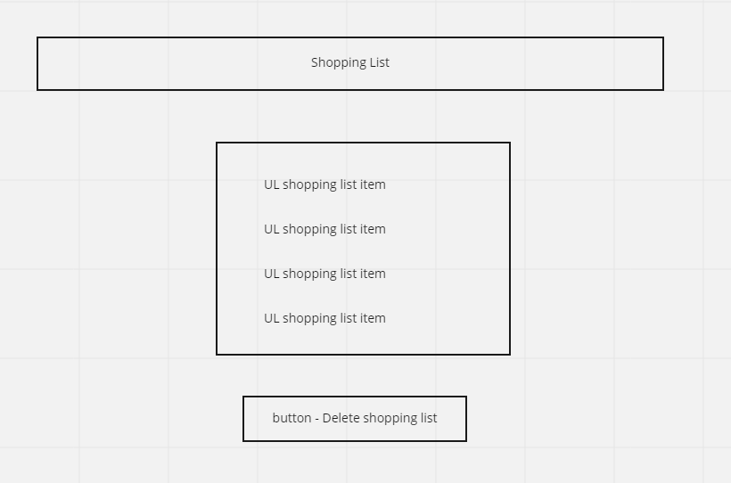

# Shopping List

Create an app where users can log in and create a shopping list. User should be able to cross off items and delete list

Log in and create account features were already done.

## Create item using form

    - fetch function in fetch.utils
    - add event listener to submit button
    - get data using new formdata and send it to supabase

## List all items

    - fetch function in fetch.utils
    - render function in render.utils
    - display function in app.js
    - call display function on page load

## Cross out item

    - update function in fetch.utils
    - event handler on list elements so that they become clickable and when clicked they will get a strike thru
    - call display function again

## Delete button

    - delete function in fetch.utils
    - add click event listener for delete function
